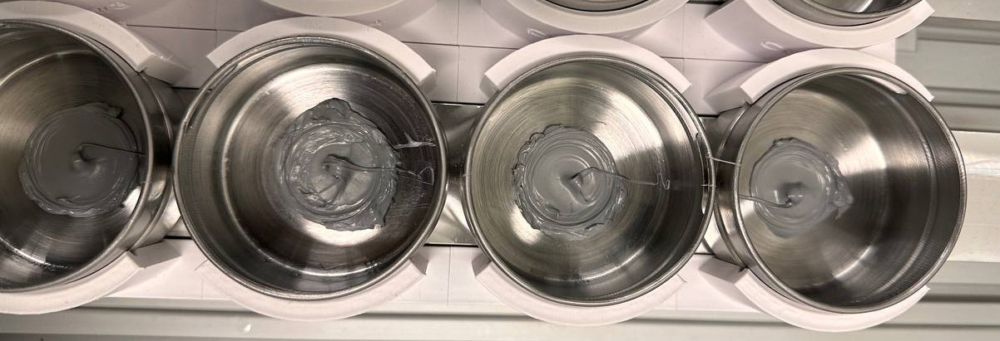
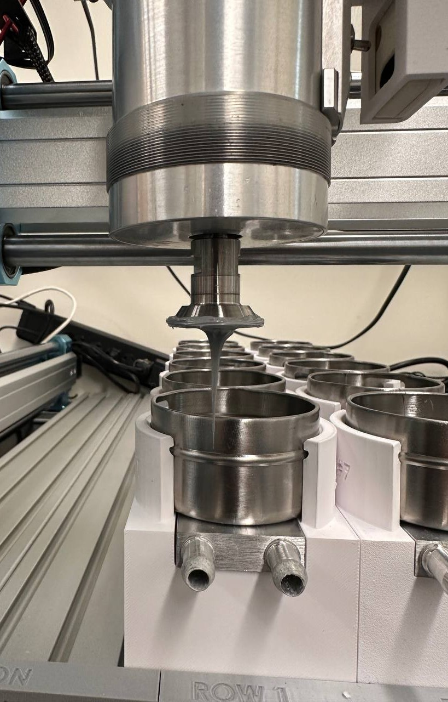
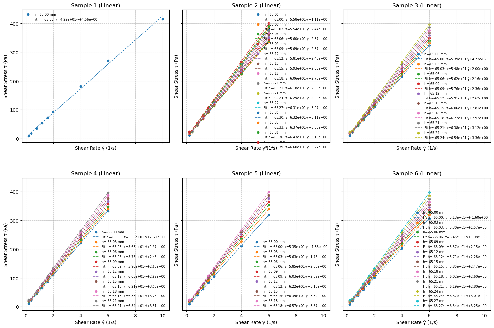
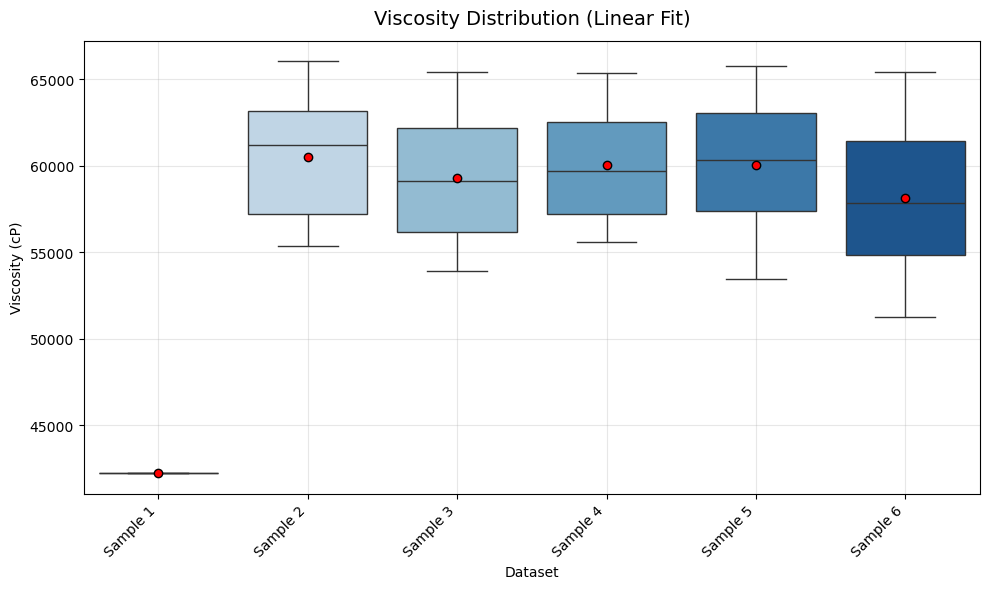

# Rheology Study: Automated Analysis Pipeline
<p align="center" width="100%">
  
</p>

<p align="center" width="100%">
  
</p>
> **Figures:** DOWSIL-TC-5888 sample tested automatically.

## Overview
This repository provides a complete, automated pipeline for analyzing rheological data from cone-plate viscometer experiments. The workflow is implemented in the Jupyter notebook `stress_strain.ipynb` and is designed for rapid, reproducible analysis of multiple samples.

---

## Directory Structure
```
Rheology_study/
├── stress_strain.ipynb         # Main analysis notebook
├── Data/
│   ├── DOWSIL_TC_5888/        # Example dataset folder
│   │   └── dynamic_analysis_cell_*.csv
│   └── Si_60K/                # Example dataset folder
│       └── dynamic_analysis_cell_*.csv
└── README.md                  # Project documentation (this file)
```

---

## Features
- **Automated Data Loading:** Handles multiple CSV datasets for batch analysis.
- **Raw Data Visualization:** Plots torque (%) vs spindle speed (rpm) for quality control.
- **Rheological Calculations:** Computes shear stress and shear rate with finite-gap correction.
- **Model Fitting:** Supports both linear (Newtonian) and power-law (non-Newtonian) models.
- **Viscosity Extraction:** Extracts and compares viscosity values across samples.
- **Publication-Ready Graphics:** Generates clear, customizable plots for reports and publications.

---

## Quick Start
1. **Clone the repository:**
   ```
   git clone https://github.com/mahdi-rstgr/Rheology_study.git
   cd Rheology_study
   ```
2. **Install dependencies:**
   - Python 3.8+
   - Install required packages:
     ```
     pip install pandas numpy matplotlib seaborn scipy
     ```
3. **Add your data:**
   - Place your CSV files in a new folder under `Data/`.
   - Update file paths in the notebook as needed.
4. **Run the notebook:**
   - Open `stress_strain.ipynb` in Jupyter or VS Code.
   - Run all cells sequentially.

---

## Example Graphics
Below are example outputs generated by the pipeline:

### 1. Raw Torque vs Speed for SI-60K


### 2. Fitted Stress-Strain Curves for SI-60K


### 3. Viscosity Comparison for SI-60K


> **Note:** These results are all for Silicon 60,000 cP.

---

## Customization
- **Rheometer Parameters:**
  - Adjust cone angle, radius, and gap in the notebook to match your instrument.
- **Data Format:**
  - Ensure CSV files follow the expected format (see notebook for details).
- **Model Selection:**
  - Switch between linear and power-law fits as appropriate for your samples.

---

## License
This project is licensed under the MIT License. See [LICENSE](LICENSE) for details.

---

## Contact
For questions or contributions, open an issue or contact the repository owner.
