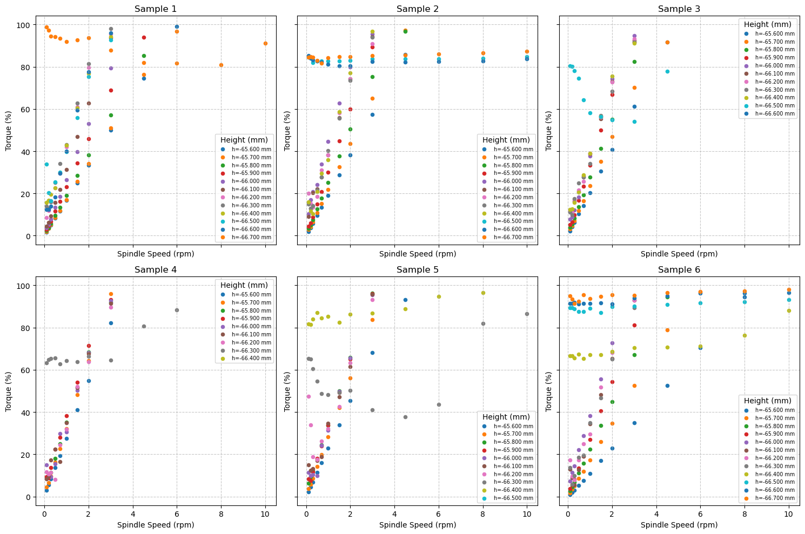
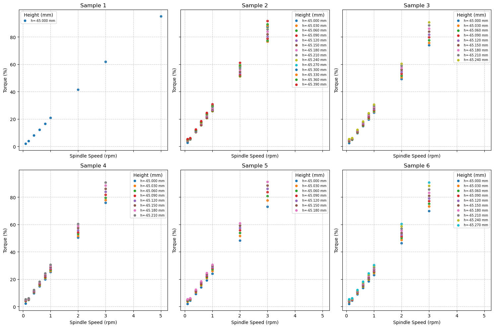
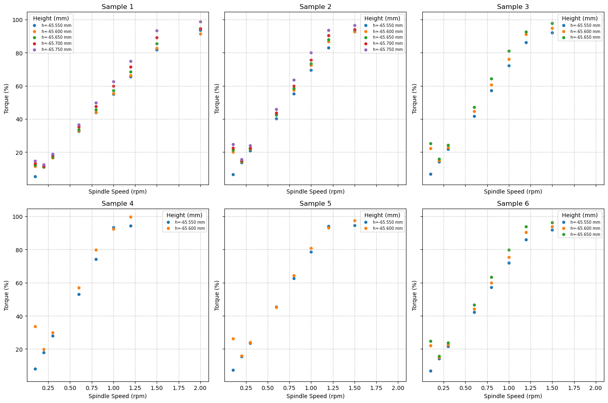
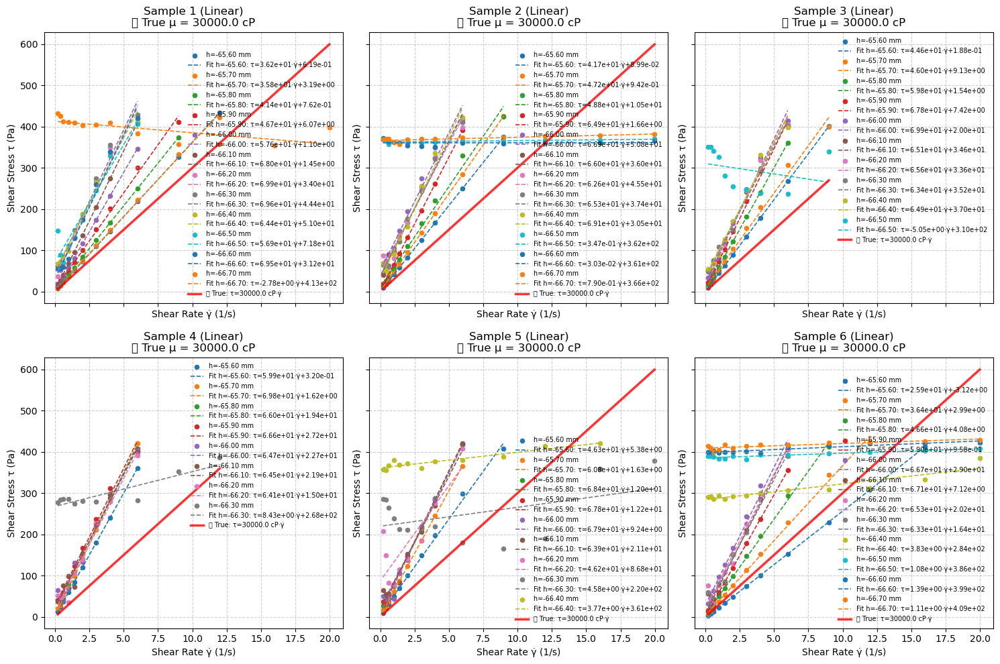
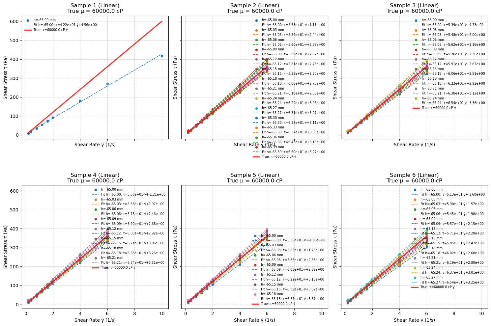
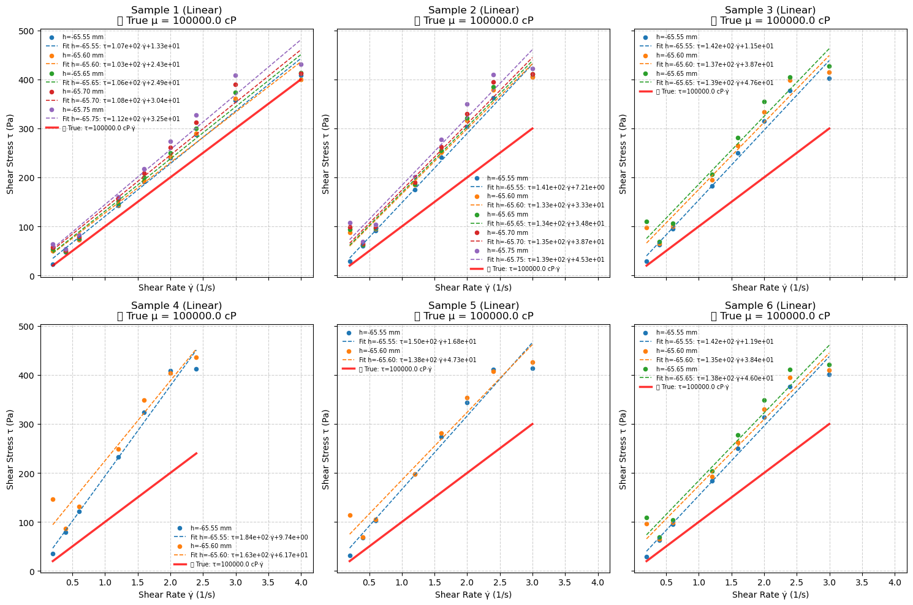
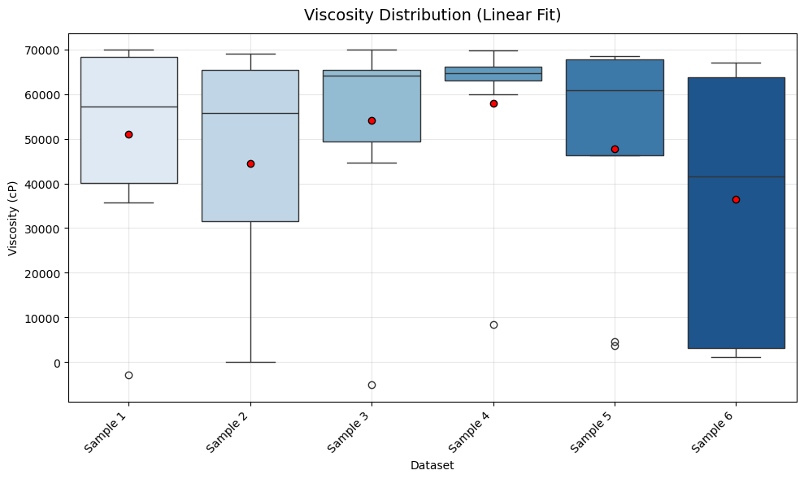
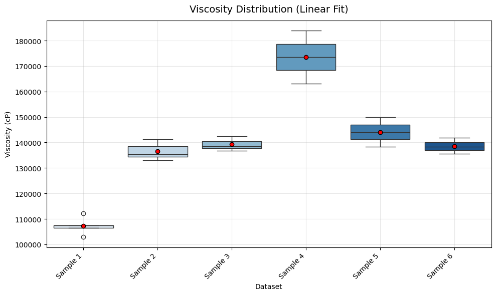

# Rheology Study: Automated Analysis Pipeline
<p align="center" width="100%">
  
</p>

<p align="center" width="100%">
  
</p>

> **Figures:** DOWSIL-TC-5888 sample tested automatically.

---

## Overview
This repository provides a complete, automated pipeline for analyzing rheological data from cone-plate viscometer experiments. The workflow is implemented in the Jupyter notebook `stress_strain.ipynb` and is designed for rapid, reproducible analysis of multiple samples.

---

## Directory Structure
```
Rheology_study/
├── stress_strain.ipynb         # Main analysis notebook
├── Data/
│   ├── DOWSIL_TC_5888/        # Example dataset folder
│   │   └── dynamic_analysis_cell_*.csv
│   └── Si_60K/                # Example dataset folder
│       └── dynamic_analysis_cell_*.csv
└── README.md                  # Project documentation (this file)
```

---

## Features
- **Automated Data Loading:** Handles multiple CSV datasets for batch analysis.
- **Raw Data Visualization:** Plots torque (%) vs spindle speed (rpm) for quality control.
- **Rheological Calculations:** Computes shear stress and shear rate with finite-gap correction.
- **Model Fitting:** Supports both linear (Newtonian) and power-law (non-Newtonian) models.
- **Viscosity Extraction:** Extracts and compares viscosity values across samples.
- **Publication-Ready Graphics:** Generates clear, customizable plots for reports and publications.

---

## Quick Start
1. **Clone the repository:**
   ```
   git clone https://github.com/mahdi-rstgr/Rheology_study.git
   cd Rheology_study
   ```
2. **Install dependencies:**
   - Python 3.8+
   - Install required packages:
     ```
     pip install pandas numpy matplotlib seaborn scipy
     ```
3. **Add your data:**
   - Place your CSV files in a new folder under `Data/`.
   - Update file paths in the notebook as needed.
4. **Run the notebook:**
   - Open `stress_strain.ipynb` in Jupyter or VS Code.
   - Run all cells sequentially.

---

## Dataset Comparison
Below are comparison tables showing the analysis results for different silicon samples:

### 1. Raw Torque vs Speed Data Comparison

| Si_30K | Si_60K | Si_100K |
|:------:|:-----------:|:-----------:|
|  |  |  |
| Silicon 60,000 cP | Silicon 100,000 cP (20s duration) | Silicon 100,000 cP (45s duration) |

### 2. Fitted Stress-Strain Curves Comparison

| Si_30K | Si_60K | Si_100K |
|:------:|:-----------:|:-----------:|
|  |  |  |
| Silicon 60,000 cP | Silicon 100,000 cP (20s duration) | Silicon 100,000 cP (45s duration) |

### 3. Viscosity Distribution Comparison

| Si_30K | Si_60K | Si_100K |
|:------:|:-----------:|:-----------:|
|  |  |  |
| Silicon 60,000 cP | Silicon 100,000 cP (20s duration) | Silicon 100,000 cP (45s duration) |

> **Note:** The pipeline enables comprehensive comparison between different silicon samples and measurement conditions, showing clear differences in rheological behavior.

---

## Customization
- **Rheometer Parameters:**
  - Adjust cone angle, radius, and gap in the notebook to match your instrument.
- **Data Format:**
  - Ensure CSV files follow the expected format (see notebook for details).
- **Model Selection:**
  - Switch between linear and power-law fits as appropriate for your samples.


---

## Contact
m.rastegardoost@gmail.com
